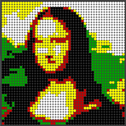
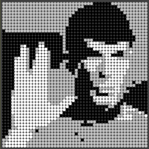

Pellet Rendering
================

An approach to render bitmap graphics into the limited color space of airgun pellets.
Airgun pellets are available in various colors. The set initially used had pellets in black, blue, green,red, yellow, grey and white. The pellet diameter is 6 mm.

The idea for the rendering is to transform arbitrary bitmap data into a good representation using the pellet colors and the typically canvas with a reduced resolution. A 14 inch canvas, for example, in 4:3 ratio fills up with 48 x 37 = 2600 pellets.

Variables for rendering are

* Choose an area of the source image bitmap
* Adjust brightness and contrast
* Pick the pellet colors for the target image
* Calculate a color for each position of the target canvas.

Keyboard
--------
* *pellet selection*
	* **0** - **9** = toggle usage of pellet by id
	* **b** = black and white, only
	* **a** = standard palette 
* *brightness and contrast transformations*
	* **up** = less contrast
	* **down** = more contrast
	* **left** = brighter
	* **right** = darker
	* **r** = reset brightness (0) and contrast (1) 
* *image options*
	* **n** - next image (cycle through image list) 
	* **-** - decrease number of pellets (min. 1x1) 
	* **+** - increase number of pellets (max. 64x64) 

Color quantification
--------------------
* Method #1: [Euclidean color distance](http://en.wikipedia.org/wiki/Euclidean_distance) to get the closes matching pellet color in RGB color space
* Method #2: [Floyd–Steinberg dithering](http://en.wikipedia.org/wiki/Floyd%E2%80%93Steinberg_dithering) for additional error distribution to neighbor pixels

Examples
--------

Environment
-----------
* [Processing](http://www.processing.org/) Version 2.1
* Windows 7 (64 bit)

Version history
---------------
* 0.85 / 2014-03-12 - Change number of pellets with +/-
* 0.84 / 2014-03-09 - Simple pellet statistics
* 0.83 / 2014-03-08 - Floyd–Steinberg dithering with pellet objects