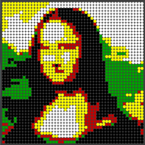
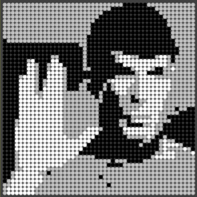

Pellet Rendering
================

An approach to render bitmap graphics into the limited color space of airgun pellets.
[Airsoft Pellets](http://en.wikipedia.org/wiki/Airsoft_pellets) are available in various colors. The set initially used had pellets in black, blue, green,red, yellow, grey and white. 

The pellet diameter is 6 mm.

The idea for the rendering is to transform arbitrary bitmap data into a good representation using the pellet colors and the typically canvas with a reduced resolution. A 14 inch canvas, for example, in 4:3 ratio fills up with 48 x 37 = 2600 pellets.

Variables for rendering are

* Choose an area of the source image bitmap
* Adjust brightness and contrast
* Pick the pellet colors for the target image
* Calculate a color for each position of the target canvas.

Visit the [Project build blog page](https://hackerspace-ffm.de/wiki/index.php?title=Airsoft_Pellet_Bitmaps_(build_blog)) for more details.

Examples
--------

Environment
-----------
* [Processing](http://www.processing.org/) Version 2.1
* Arduino 1.00 IDE
* Windows 7 (64 bit)

